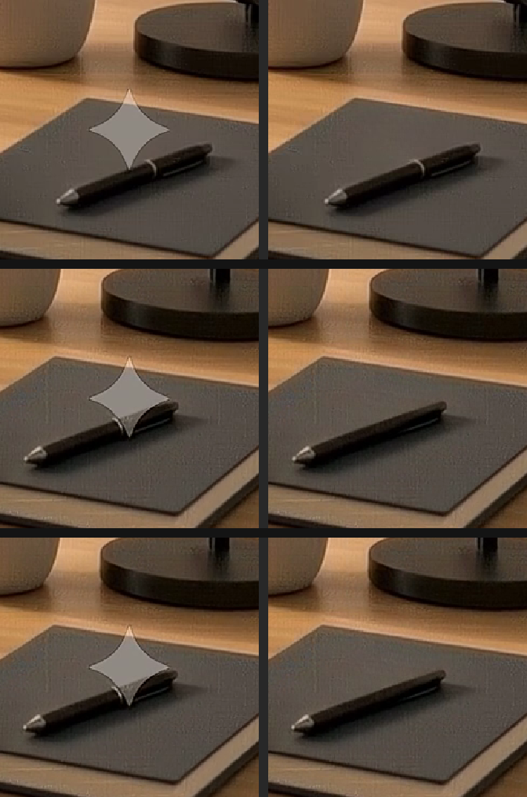

# Gemini / Veo Watermark Remover  (16:9)

Remove the visible Gemini "spark" watermark from a 16:9 video with **no visible
trace** — scene and audio preserved. Built and verified on real Veo clips
(1280×720 and 1920×1080).



## Quickstart
```bash
# 1) setup (once) — installs python deps + downloads the LaMa model (~196 MB)
bash scripts/setup.sh
#    also needs ffmpeg:  brew install ffmpeg

# 2) remove the watermark
python3 scripts/remove_watermark.py my_veo_clip.mp4 -o my_veo_clip_clean.mp4
```
Output defaults to `INPUT_clean.mp4` next to the input if `-o` is omitted.

## Options
| flag | default | meaning |
|------|---------|---------|
| `-o, --output` | `INPUT_clean.mp4` | output path |
| `--engine` | `auto` | `auto` \| `lama` \| `composite` |
| `--mask` | `assets/gemini_watermark.png` | the 48×48 spark template |
| `--pos` | (auto) | force the box: `"cx,cy,size"` (skips detection) |
| `--crf` | `15` | output quality (lower = better) |
| `--keep-temp` | off | keep extracted frames for inspection |

## How it works
1. **Detect** the spark automatically (removal-residual search on the
   temporal-mean frame, bottom-right of the 16:9 frame; size scales with height).
2. **Calibrate** the spark opacity α per clip.
3. **Remove** per frame:
   - **LaMa** ML inpainting (static/structural scenes) — rebuilds real
     structure that crosses the mark (e.g. a pen) and reconnects it on every
     frame. *This is what gets to a clean, traceless result.*
   - **Composite** inverse alpha-removal (moving backgrounds) — recovers the
     true semi-transparent background per frame; instant.
   - Auto-chosen by the region's temporal variance; override with `--engine`.
4. **Re-encode** + **remux original audio**.

## Why per-frame LaMa
The watermark is fixed on screen, but the scene drifts slightly over time. A
single shared fill snaps objects (the pen) at the start/end frames. Inpainting
**each frame independently** reconnects structure to that frame — verified clean
across all frames, including the ends.

## Performance
- `composite`: near-instant (seconds for a whole clip). Great for moving
  backgrounds.
- `lama`: CPU, ~2–3 s/frame (≈3 min for a 4 s clip). Best for static scenes and
  objects crossing the mark. (GPU/MPS would be much faster; this build runs CPU
  for portability.)

## Verified quality
- Residual watermark signal at the **measurement noise floor** (no detectable
  spark).
- **No temporal flicker** (matches source), **grain-matched** to surroundings.
- Structure (e.g. pen) **continuous** across all frames; **audio preserved**.

## Limitations
- Tuned for **16:9** (bottom-right placement). Other ratios: pass `--pos`.
- Assumes a single spark in the bottom-right; otherwise use `--pos`.
- Removes the **visible** mark only — invisible provenance (e.g. SynthID) is not
  targeted and remains. Use on content you own / have the right to edit.

## Files
```
Gemini Watermark Remover Skill/
├── SKILL.md                     # skill definition (frontmatter + agent instructions)
├── README.md                    # this file
├── requirements.txt             # python deps
├── assets/gemini_watermark.png  # 48×48 spark template (alpha shape)
├── scripts/
│   ├── remove_watermark.py      # the engine (detect + lama/composite + mux)
│   └── setup.sh                 # installer
└── examples/before_after_example.png
```
